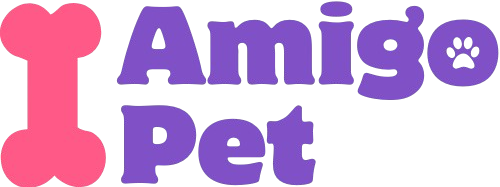

<p align="center">
  
</p>

<p align="center">
  <strong>Sistema de gerenciamento para os nossos melhores amigos</strong>
</p>

<p align="center">
  <a href="#apresentacao">Apresentação</a> •
  <a href="#sobre">Sobre</a> •
  <a href="#tecnologias">Tecnologias</a> •
  <a href="#funcionalidades">Funcionalidades</a> •
  <a href="#instalação">Instalação</a> •
  <a href="#uso">Como Usar</a> •
  <a href="#equipe">Equipe</a>
</p>

## 🎬 <a id="apresentacao"></a>Apresentação

https://github.com/user-attachments/assets/257fd941-356b-492e-bf8a-0755a57a2e85

[](https://github.com/Igorcbraz/AmigoPet-api)

## 📋 <a id="sobre"></a>Sobre

AmigoPet é uma aplicação web desenvolvida para auxiliar no gerenciamento dos nossos pets, facilitando o agendamento de consultas, controle de vacinas, cadastro de pets, além de outras funcionalidades essenciais para o dia a dia destes bichinhos.

## 🚀 <a id="tecnologias"></a>Tecnologias

Este projeto foi desenvolvido utilizando as seguintes tecnologias:

- [Vue.js](https://vuejs.org/)
- [Quasar Framework](https://quasar.dev/)
- [Node.js](https://nodejs.org/)
- [JavaScript/ES6+](https://developer.mozilla.org/en-US/docs/Web/JavaScript)

## ✨ <a id="funcionalidades"></a>Funcionalidades

- Cadastro de usuários
- Cadastro de pets
- Início (Dashboard) - Painel principal com visão geral do pet.
- Agenda - Calendário com os agendamentos (consultas, vacinas, banhos, adestramento, pet sitter).
- Notificações - Lista de lembretes: medicação, alimentação, passeios, higiene, etc.

## 🔧 <a id="instalação"></a>Instalação

### Pré-requisitos

- Node.js (versão 20.x ou superior)
- NPM (10.x ou superior) ou Yarn

### Passos para instalação

1. Clone o repositório

```bash
git clone https://github.com/Igorcbraz/AmigoPet.git
cd AmigoPet
```

2. Instale as dependências

```bash
npm install
```

## 📱 <a id="uso"></a>Como Usar

Iniciar em modo de desenvolvimento

```bash
quasar dev
```

Verificação de código (Lint)

```bash
npm run lint
```

Formatação de código

```bash
npm run format
```

Compilar para produção

```bash
quasar build
```

## 👨‍💻 <a id="equipe"></a>Equipe de Desenvolvimento

- ARNALDO PAGANI JUNIOR
- GABRIELLE CRISTINE SIMOES PESSOTTO
- IGOR COSTA BRAZ
- JOÃO RAFAEL DE OLIVEIRA DE MACEDO
- KAMILA DOS SANTOS LUZ
- LUCAS BADUINA STEFANI
- RAFAEL DA FONSECA TEIXEIRA
- ROBSON GLEIDSON DA SILVA

## 📄 Licença

Este projeto está sob a licença MIT - veja o arquivo LICENSE para mais detalhes.

<p align="center"> Desenvolvido com ❤️ pela equipe AmigoPet </p>
